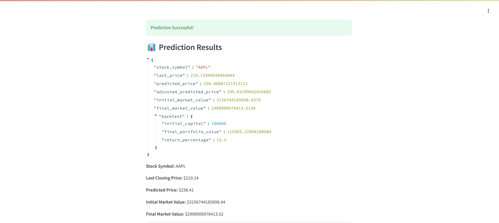
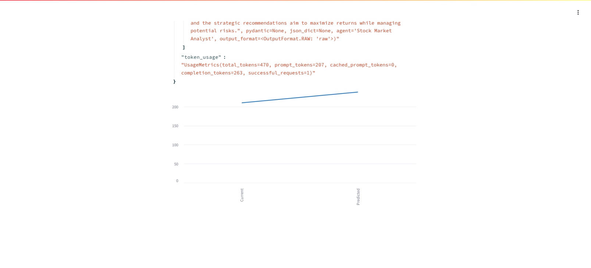

# Market Prediction and Portfolio Impact Analysis

## Project Overview

The **Market Prediction and Portfolio Impact Analysis** project is a tool designed to assist traders in assessing the potential impact of various market events on their portfolios. Using a combination of historical market data, real-time feeds, machine learning algorithms, and statistical models, the system predicts future market trends and visualizes how these trends will influence an investor's portfolio.

**My Contribution**: I primarily focused on the development of the market prediction input handler, real-time data integration, ML-based forecasting models, and portfolio impact visualization. Additionally, I worked on enhancing the follow-up query handling functionality, allowing traders to refine their predictions.

## Sprint Objectives Summary

| Sprint   | Objective                                                                                             | Outcome                                                                                     |
|----------|-------------------------------------------------------------------------------------------------------|---------------------------------------------------------------------------------------------|
| **Sprint 1** | Minimal Viable Product (MVP): Develop the core market prediction engine and integrate Yahoo Finance API for fetching historical data. | Completed input handler and data integration for market queries.                             |
| **Sprint 2** | Infrastructure Spike: Enhance prediction models with statistical analysis and real-time data integration; develop portfolio correlation analysis. | Real-time feeds integrated, statistical forecasting models implemented.                     |
| **Sprint 3** | Experimental Agent Selection: Implement and test advanced ML models; integrate CrewAI for optimization. | Integrated CrewAI with ML predictions and developed visual impact representation.           |
| **Sprint 4** | Working MVP: Finalize the prediction engine and optimize the system for scalability and performance.  | Refactored main forecasting function and optimized follow-up handling logic.                 |

## Summarized User Story / Task Section

| **Sprint** | **User Story/Task** | **Key Tasks** |
|------------|---------------------|---------------|
| **Sprint 1** | **SC1.1**: Developed the Market Prediction Input Handler to process trader queries and integrated Yahoo Finance API for stock data fetching. | Implemented user input handler class, integrated Yahoo Finance API, and ensured smooth data retrieval for predictions. |
| **Sprint 2** | **SC1.2**: Integrated Historical Market Data and Real-Time Feeds to enhance the prediction engine with fresh market data. | Integrated market data feeds. |
| | **SC1.3**: Developed Statistical and ML-Based Forecasting Models for stock prediction. | Created statistical models and implemented machine learning-based forecasting. |
| | **SC1.4**: Created Portfolio Correlation Analysis to show how market changes affect portfolio assets. | Developed correlation analysis for portfolio impact. |
| | **SC1.5**: Completed Unit Testing for prediction outputs to ensure reliability and accuracy. | Conducted unit testing for prediction outputs. |
| | **SC1.6**: Integrated a Charting Library (Plotly/Matplotlib) to visualize market predictions. | Integrated Plotly/Matplotlib for data visualization. |
| **Sprint 3** | **SC1.7**: Integrated CrewAI with ML Algorithms to enhance prediction accuracy. | Integrated CrewAI for prediction accuracy. |
| | **SC1.8**: Developed visual representations of how market predictions impact portfolios, helping traders visualize changes in real-time. | Developed visual impact charts for portfolio analysis. |
| | **SC1.9**: Implemented Follow-Up Query Handling to allow traders to adjust their predictions, optimizing the system’s responsiveness. | Refined follow-up query logic for real-time adjustments. |
| **Sprint 4** | **SC1.10**: Finalized the Main Forecasting Function, ensuring scalability and optimization. | Refined the forecasting function for performance. |
| | **SC1.11**: Improved Follow-Up Handling Logic to better process multiple queries and adjustments. | Optimized the follow-up handling logic for multiple queries. |
| | **SC1.12**: Optimized CrewAI and ML Prediction Flow for performance and accuracy. | Optimized CrewAI and ML prediction flow for accuracy. |

## Contributions

### GitHub Repository
- [GitHub Repository](https://github.com/Narrab891/AI-Agent-Stock-Prediction)

### Code Contributions
Here are some key snippets showcasing my contributions:

- **Market Prediction Input Handler**: [Code Example](https://github.com/Narrab891/AI-Agent-Stock-Prediction/commit/e6690801c1a597fa367b9f8ac3e09f579215da0e#diff-423758a6c9d4dfadaf1c0bdaec3b35d8c2df99b28cbdb74218e9e998c488dffd)
  
- **Prediction Engine**: [Code Example](https://github.com/Narrab891/AI-Agent-Stock-Prediction/commit/e6690801c1a597fa367b9f8ac3e09f579215da0e#diff-ecae6d98f757ef80b581e3fefe79487b89124fbfba053ed7ff084b47c996c92a)
  
- **Portfolio Impact Visualization**: [Code Example](https://github.com/Narrab891/AI-Agent-Stock-Prediction/commit/e6690801c1a597fa367b9f8ac3e09f579215da0e#diff-423758a6c9d4dfadaf1c0bdaec3b35d8c2df99b28cbdb74218e9e998c488dffd)

### Results

## Appendix

### All Commits

Here is the full list of commits associated with this project. Each commit links directly to the respective commit in the GitHub repository:

- **Sprint 1**: Implemented Market Prediction Input Handler and Yahoo Finance API integration.
- **Sprint 2**: Integrated real-time market data and statistical forecasting models.
- **Sprint 3**: Added CrewAI integration and ML algorithm for optimized predictions.
- **Sprint 4**: Refactored main forecasting function and optimized prediction flow.

You can view all commits on the [GitHub repository commit page](https://github.com/Narrab891/AI-Agent-Stock-Prediction/commits).
