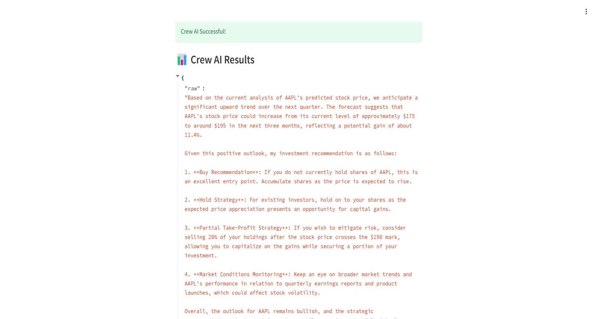

<!DOCTYPE html>
<html lang="en">
<head>
    <meta charset="UTF-8">
    <meta name="viewport" content="width=device-width, initial-scale=1.0">
    <title>Market Prediction and Portfolio Impact Analysis</title>
    
</head>
<body>

    <h1>Market Prediction and Portfolio Impact Analysis</h1>

    <h2>Project Overview</h2>
    
The <strong>Market Prediction and Portfolio Impact Analysis</strong> project is a tool designed to assist traders in assessing the potential impact of various market events on their portfolios. Using a combination of historical market data, real-time feeds, machine learning algorithms, and statistical models, the system predicts future market trends and visualizes how these trends will influence an investor's portfolio.

    
<strong>My Contribution</strong>: I primarily focused on the development of the market prediction input handler, real-time data integration, ML-based forecasting models, and portfolio impact visualization. Additionally, I worked on enhancing the follow-up query handling functionality, allowing traders to refine their predictions.

    <h2>Sprint Objectives Summary</h2>
    <table>
        <tr>
            <th>Sprint</th>
            <th>Objective</th>
            <th>Outcome</th>
        </tr>
        <tr>
            <td><strong>Sprint 1</strong></td>
            <td>Minimal Viable Product (MVP): Develop the core market prediction engine and integrate Yahoo Finance API for fetching historical data.</td>
            <td>Completed input handler and data integration for market queries.</td>
        </tr>
        <tr>
            <td><strong>Sprint 2</strong></td>
            <td>Infrastructure Spike: Enhance prediction models with statistical analysis and real-time data integration; develop portfolio correlation analysis.</td>
            <td>Real-time feeds integrated, statistical forecasting models implemented.</td>
        </tr>
        <tr>
            <td><strong>Sprint 3</strong></td>
            <td>Experimental Agent Selection: Implement and test advanced ML models; integrate CrewAI for optimization.</td>
            <td>Integrated CrewAI with ML predictions and developed visual impact representation.</td>
        </tr>
        <tr>
            <td><strong>Sprint 4</strong></td>
            <td>Working MVP: Finalize the prediction engine and optimize the system for scalability and performance.</td>
            <td>Refactored main forecasting function and optimized follow-up handling logic.</td>
        </tr>
    </table>

    <h2>Summarized User Story / Task Section</h2>
    <table>
        <tr>
            <th>Sprint</th>
            <th>User Story/Task</th>
            <th>Key Tasks</th>
        </tr>
        <tr>
            <td><strong>Sprint 1</strong></td>
            <td><strong>SC1.1</strong>: Developed the Market Prediction Input Handler to process trader queries and integrated Yahoo Finance API for stock data fetching.</td>
            <td>Implemented user input handler class, integrated Yahoo Finance API, and ensured smooth data retrieval for predictions.</td>
        </tr>
        <tr>
            <td><strong>Sprint 2</strong></td>
            <td><strong>SC1.2</strong>: Integrated Historical Market Data and Real-Time Feeds to enhance the prediction engine with fresh market data.</td>
            <td>Integrated market data feeds.</td>
        </tr>
        <tr>
            <td></td>
            <td><strong>SC1.3</strong>: Developed Statistical and ML-Based Forecasting Models for stock prediction.</td>
            <td>Created statistical models and implemented machine learning-based forecasting.</td>
        </tr>
        <tr>
            <td></td>
            <td><strong>SC1.4</strong>: Created Portfolio Correlation Analysis to show how market changes affect portfolio assets.</td>
            <td>Developed correlation analysis for portfolio impact.</td>
        </tr>
        <tr>
            <td></td>
            <td><strong>SC1.5</strong>: Completed Unit Testing for prediction outputs to ensure reliability and accuracy.</td>
            <td>Conducted unit testing for prediction outputs.</td>
        </tr>
        <tr>
            <td></td>
            <td><strong>SC1.6</strong>: Integrated a Charting Library (Plotly/Matplotlib) to visualize market predictions.</td>
            <td>Integrated Plotly/Matplotlib for data visualization.</td>
        </tr>
        <tr>
            <td><strong>Sprint 3</strong></td>
            <td><strong>SC1.7</strong>: Integrated CrewAI with ML Algorithms to enhance prediction accuracy.</td>
            <td>Integrated CrewAI for prediction accuracy.</td>
        </tr>
        <tr>
            <td></td>
            <td><strong>SC1.8</strong>: Developed visual representations of how market predictions impact portfolios, helping traders visualize changes in real-time.</td>
            <td>Developed visual impact charts for portfolio analysis.</td>
        </tr>
        <tr>
            <td></td>
            <td><strong>SC1.9</strong>: Implemented Follow-Up Query Handling to allow traders to adjust their predictions, optimizing the system’s responsiveness.</td>
            <td>Refined follow-up query logic for real-time adjustments.</td>
        </tr>
        <tr>
            <td><strong>Sprint 4</strong></td>
            <td><strong>SC1.10</strong>: Finalized the Main Forecasting Function, ensuring scalability and optimization.</td>
            <td>Refined the forecasting function for performance.</td>
        </tr>
        <tr>
            <td></td>
            <td><strong>SC1.11</strong>: Improved Follow-Up Handling Logic to better process multiple queries and adjustments.</td>
            <td>Optimized the follow-up handling logic for multiple queries.</td>
        </tr>
        <tr>
            <td></td>
            <td><strong>SC1.12</strong>: Optimized CrewAI and ML Prediction Flow for performance and accuracy.</td>
            <td>Optimized CrewAI and ML prediction flow for accuracy.</td>
        </tr>
    </table>

    <h2>Results</h2>
    
Below are some important contributions to the project (output):

    

        

            <h3>Output 1:</h3>
            
        

        

            <h3>Output 2:</h3>
            
        

        

            <h3>Output 3:</h3>
            
        

        

            <h3>Output 4:</h3>
            
        

        

            <h3>Output 5:</h3>
            
        

    

    <h2>Appendix</h2>
    <h3>All Commits</h3>
    
Here is the full list of commits associated with this project. Each commit links directly to the respective commit in the GitHub repository:

    <ul>
        <li><strong>Sprint 1</strong>: Implemented Market Prediction Input Handler and Yahoo Finance API integration.</li>
        <li><strong>Sprint 2</strong>: Integrated real-time market data and statistical forecasting models.</li>
        <li><strong>Sprint 3</strong>: Added CrewAI integration and ML algorithm for optimized predictions.</li>
        <li><strong>Sprint 4</strong>: Refactored main forecasting function and optimized prediction flow.</li>
    </ul>

    
View all commits on the <a href="https://github.com/Narrab891/AI-Agent-Stock-Prediction/commits">GitHub repository commit page</a>.

</body>
</html>
